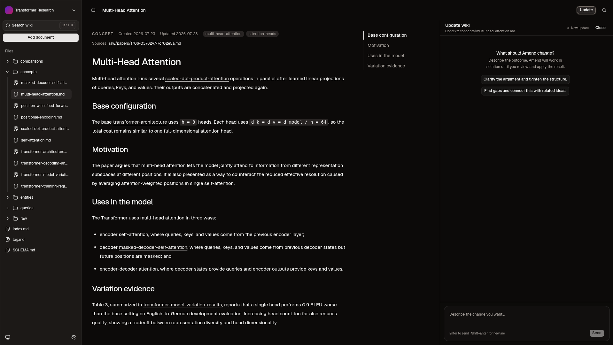

# Amend

**A local-first, self-maintaining wiki built from the documents you already
have.**

Amend turns PDFs, Markdown, and text files into a browsable knowledge wiki on
your computer. It uses an AI model to connect ideas across sources, keeps the
extracted source text alongside the generated pages, and records every
accepted change in Git.

The result is an ordinary folder of Markdown files—not a hosted database or a
proprietary export.



> Amend is under active development. There are no packaged releases yet; the
> app currently runs from source.

## What Amend does

- **Builds a wiki from source documents.** Add a PDF, Markdown file, or UTF-8
  text file and tell Amend what matters.
- **Connects new material to existing knowledge.** Later documents update the
  wiki instead of creating isolated summaries.
- **Lets you refine the wiki with AI.** Ask for an update, inspect the proposed
  file changes, then apply or discard them.
- **Keeps your data local.** Wiki files, source material, Git history, and the
  SQLite search index stay on your machine.
- **Makes every accepted change traceable.** Each ingest and AI-assisted update
  becomes a Git commit with run metadata.
- **Searches across pages and sources.** Amend builds a derived full-text index
  without putting the database inside your wiki repository.

## How it works

Each wiki is a standalone Git repository containing:

```text
my-wiki/
├── index.md             # Wiki front page
├── entities/            # People, organizations, systems, and other things
├── concepts/            # Ideas and mechanisms
├── comparisons/         # Explicit contrasts and trade-offs
├── queries/             # Question-oriented synthesis
├── raw/                 # Preserved source material
├── log.md               # Append-only history of Amend runs
└── .amend/              # Wiki identity and run metadata
```

Amend stages AI work in an isolated Git worktree, validates the result, and
only promotes it to the wiki after the run succeeds. Interactive wiki updates
remain proposals until you choose **Apply**.

Wiki storage and indexing are local. During AI-assisted ingest and updates,
relevant content is sent to the model provider you connect during onboarding;
provider authentication also communicates with that provider.

## Run from source

### Prerequisites

- [Git](https://git-scm.com/) available on `PATH`
- [mise](https://mise.jdx.dev/) for the pinned Node.js and pnpm versions
- Credentials for a model provider supported by
  [Pi](https://github.com/badlogic/pi-mono)

The workspace currently pins Node.js 22.23.1 and pnpm 10.33.4. If you do not
use mise, install compatible versions yourself; Node.js 22.13.0 or newer is
required.

### Start the desktop app

```bash
git clone https://github.com/cipher416/amend.git
cd amend
mise install
pnpm install
pnpm dev
```

`pnpm dev` starts the Vite renderer on `127.0.0.1:3001` and launches Electron.
The browser URL is only a development renderer; wiki features require the
desktop app.

On first launch:

1. Connect a model provider.
2. Choose a **wiki home**, the directory where Amend will create wiki folders.
3. Add a PDF, Markdown, or text document up to 25 MB.
4. Name the wiki and optionally describe what Amend should focus on.
5. Wait for Amend to extract, organize, validate, commit, and index the result.

Every wiki is created as a sibling directory directly inside the selected wiki
home.

## Model providers

Amend uses the Pi model registry and credential store. During onboarding you
can:

- Sign in to Anthropic with Claude Pro/Max.
- Sign in to OpenAI with ChatGPT Plus/Pro through Codex.
- Enter an API key for another provider known to Pi, including OpenAI, Google,
  Mistral, and Z.ai.

After authentication, choose the default model Amend should use. Configuration
is stored in `~/.pi/agent/settings.json` and credentials in
`~/.pi/agent/auth.json`.

OAuth, API keys, token exchange, filesystem access, and model execution are
handled in the Electron main process. The renderer only receives provider and
model identifiers plus login progress—it never receives credentials.

## Development

This is a pnpm/Turborepo monorepo:

| Path | Purpose |
| --- | --- |
| `apps/desktop` | Electron main process, secure preload bridge, and desktop services |
| `apps/web` | React 19 and TanStack Router renderer |
| `packages/wiki-engine` | Git-backed ingest, update, validation, and SQLite indexing |
| `packages/contract` | Runtime-validated IPC types and channel contracts |
| `packages/ui` | Shared shadcn/ui components and styles |
| `packages/evals` | Live model quality evaluations |

Useful commands:

```bash
pnpm dev                # Run Vite and Electron
pnpm test               # Run the test suite
pnpm typecheck          # Check TypeScript
pnpm lint               # Run ESLint
pnpm format             # Format workspace sources
pnpm build              # Build all packages
pnpm package:desktop    # Create an unpacked desktop application
```

The unpacked application is written beneath `apps/desktop/out/`.

To add a shared shadcn/ui component:

```bash
pnpm dlx shadcn@latest add button -c apps/web
```

Components are installed in `packages/ui/src/components` and imported through
the `@workspace/ui` package.

### Desktop security boundary

The renderer is a prerendered SPA shell. Development uses Vite for hot module
replacement; packaged builds copy only the static client output and load it
through the `app://amend/` protocol. No TanStack Start server is packaged or
started.

Keep Git, filesystem, SQLite, credentials, and model access in the Electron
main process behind the typed preload IPC boundary. Do not introduce runtime
server functions for desktop capabilities.

### Live evaluations

The evaluation package exercises real model-backed ingest and update flows:

```bash
pnpm eval:wiki
pnpm eval:wiki-update
```

These commands use the provider configuration in `~/.pi/agent/settings.json`,
make paid model calls, and—in the ingest evaluation—download public paper
content. They are separate from the deterministic `pnpm test` suite.

## Data and lifecycle notes

- The selected wiki home and last active wiki ID are stored in Electron's
  `userData` directory.
- Amend only opens wikis it discovers as direct children of the selected wiki
  home; arbitrary external repositories cannot be attached.
- Each wiki has a stable ID in `.amend/wiki.json`.
- The search database is a rebuildable cache stored outside the wiki.
- Ingest jobs live for the current app session. Reloading the renderer
  reconnects to a running job, but quitting the app ends it.
- An ingest can be cancelled until Git commit promotion begins.

## Project status

Amend is currently an early-stage desktop application. File formats, wiki
schema, provider support, and packaging may change while the core workflow is
being developed.

## Acknowledgements

Amend's wiki-maintenance workflow is adapted from Hermes Agent's MIT-licensed
[`llm-wiki` skill](https://hermes-agent.nousresearch.com/docs/user-guide/skills/bundled/research/research-llm-wiki),
itself based on Andrej Karpathy's LLM Wiki pattern. Amend adapts the workflow
to its local desktop, validation, and Git-based review model.
